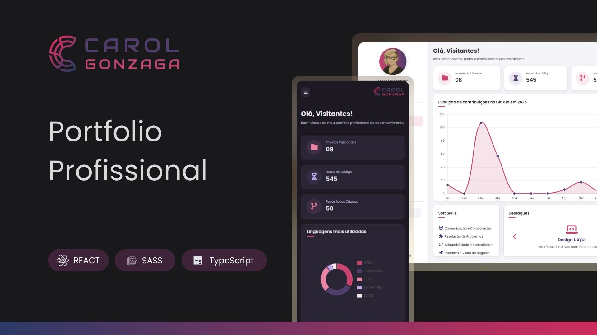

  

 

Um portfólio profissional dinâmico em formato de dashboard, consumindo a API do GitHub para exibir estatísticas em tempo real.

  <a href="#-tecnologias">Tecnologias</a>&nbsp;&nbsp;&nbsp;|&nbsp;&nbsp;&nbsp;
  <a href="#-objetivo">Objetivo</a>&nbsp;&nbsp;&nbsp;|&nbsp;&nbsp;&nbsp;
  <a href="#️-funcionalidades">Funcionalidades</a>&nbsp;&nbsp;&nbsp;|&nbsp;&nbsp;&nbsp;
  <a href="https://www.carolgonzaga.online/" target="_blank">Acesse o Projeto</a>

 
 

  

 
 

## 🚀 Tecnologias

Esse projeto foi desenvolvido com as seguintes tecnologias:

-   **React**
-   **TypeScript**
-   **Vite**
-   **Sass/SCSS**
-   **React Router**
-   **React Context**
-   **Chart.js**
-   **Vercel Serverless Functions**
-   **GitHub API**
-   **EmailJS**

 
 

## 🎯 Objetivo

O objetivo deste projeto é criar um portfólio dinâmico e colocar em prática conceitos essenciais do desenvolvimento front-end moderno, como:

-   Criação de uma aplicação SPA (Single Page Application) com React e TypeScript.
-   Consumo de uma API REST (GitHub API) de forma segura, utilizando uma Vercel Serverless Function como proxy de backend.
-   Gerenciamento de estado global complexo (Tema, Sidebar, Cache de API) através do React Context.
-   Implementação de navegação entre páginas utilizando React Router.
-   Visualização de dados dinâmica com a biblioteca `Chart.js`.
-   Criação de interface acessível, responsiva e mobile-first, utilizando SCSS Modules.
-   Integração de serviços de terceiros (EmailJS) para funcionalidade de contato.
-   Otimização de performance com cache de dados da API no `localStorage`.

 
 

## 🛠️ Funcionalidades

A aplicação permite que o usuário:

-   Visualize estatísticas em tempo real do meu perfil no GitHub, como repositórios públicos e horas de código estimadas.
-   Veja gráficos dinâmicos das linguagens mais usadas e da evolução de commits no ano.
-   Navegue pelas seções:
    -   **Home/Dashboard:** Painel principal com todos os widgets de estatísticas.
    -   **Resumo:** Informações sobre mim, experiência profissional e formação acadêmica.
    -   **Portfólio:** Galeria de projetos filtráveis por categoria (Básico, Intermediário, Avançado, Jogos).
    -   **Certificados:** Galeria de certificados com visualização em modal.
-   Alterne entre o tema claro (light mode) e escuro (dark mode), com a preferência salva no navegador.
-   Envie um e-mail diretamente para mim através de um modal de contato.
-   Faça o download do meu currículo.
-   Tenha uma experiência totalmente responsiva com um menu sidebar que se adapta a dispositivos móveis.
